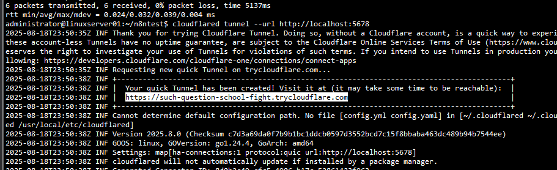
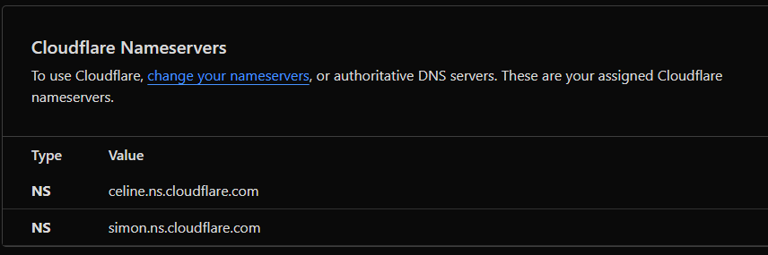
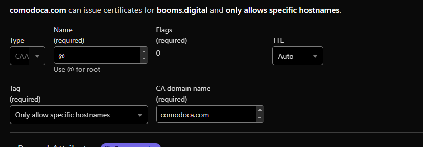
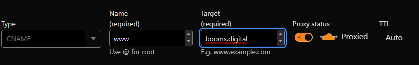
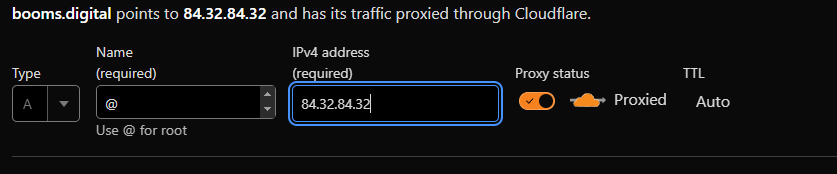
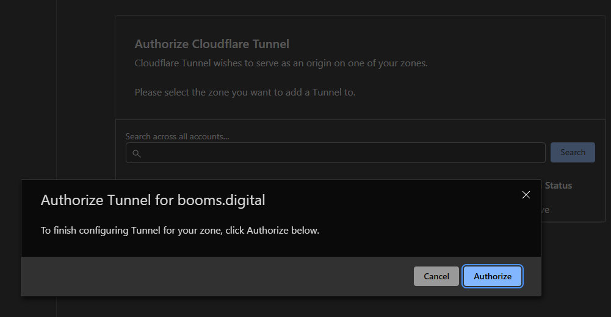
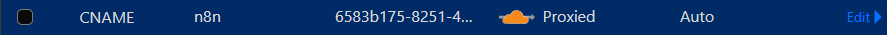
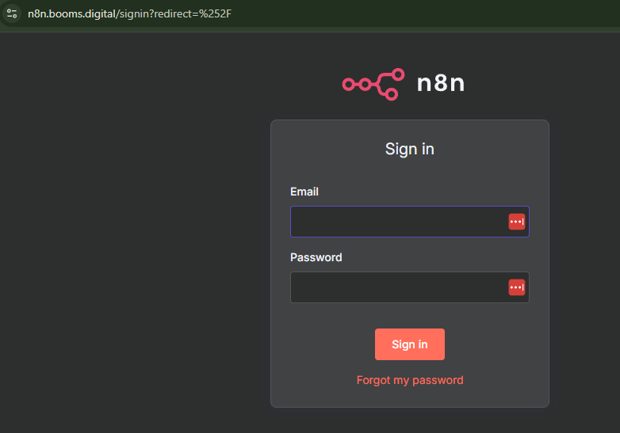

# Local linux server configuration and cloudflare installation for accesing n8n from internet
---
### Cloudflared client installation
Download the packet and proceed to install.
  ```bash
      curl -L https://github.com/cloudflare/cloudflared/releases/latest/download/cloudflared-linux-amd64.deb -o cloudflared.deb
      
      sudo dpkg -i cloudflared.deb
  ```
Validate version.
  ```bash
    cloudflared --version
  ```
### n8n Installation with docker
Install docker then execute this yaml.
```yaml
services:
n8n:
    image: n8nio/n8n
    ports:
    - "5678:5678"
    environment:
    - N8N_BASIC_AUTH_ACTIVE=true
    - N8N_BASIC_AUTH_USER=admin
    - N8N_BASIC_AUTH_PASSWORD=linuxuser
    volumes:
    - n8n_data:/home/node/.n8n
volumes:
n8n_data:
```
Execute yaml command
```bash
docker-compose up -d
```
Stop container and save all data
```bash
docker-compose down
```
Execute container automatically after start server.
Create the archive.
```
sudo nano /etc/systemd/system/n8n.service
```
Then paste this.
```
[Unit]
Description=n8n service with Docker Compose
Requires=docker.service
After=docker.service

[Service]
Type=oneshot
RemainAfterExit=true
WorkingDirectory=/home/administrator/n8n
ExecStart=/usr/bin/docker-compose up -d
ExecStop=/usr/bin/docker-compose down
TimeoutStartSec=0

[Install]
WantedBy=multi-user.target
```
Reload systemd then enable the service.
```
sudo systemctl daemon-reload
sudo systemctl enable n8n
```
Start the service manually, just once.
# The next steps are optional if you don't have a VPS with public IP
### Expose local host without domain
Exectute this command.
  ```
  cloudflared tunnel --url http://localhost:5678
  ```
Access the url provided by cloudflare, then use this credentials.
    * ai**********ert@gmail.com
    * Reafko456+
    
If everything is ok, continue with the next step.
Cons: This URL changes every time you run this command again, so it is not suitable for production environments.

### Register Hostinger domain in cloudflare
Create cloudflare free account https://dash.cloudflare.com/
I registered a domain for 1 year in hostinger with the ai*******rt@gmail.com account.
* https://hpanel.hostinger.com/
* Domain name: booms.digital

Copy the name servers to hostinger.



Configure DNS records on cloudflare.

CAA



CNAME



A



### Configure persistent tunnel on VM
Authenticate cloudflared with the CloudFlare account.
```bash
cloudflared tunnel login
```
Select domain and authorize.



Create the tunnel
```bash
clouflared tunnel create n8n-tunnel
```
Create config.yaml on ~/.cloudflared/
```yaml
tunnel: 6583b175-8251-4aa8-b8ba-2496f50c8175
credentials-file: /home/administrator/.cloudflared/6583b175-8251-4aa8-b8ba-2496f50c8175.json

ingress:
  - hostname: n8n.booms.digital
    service: http://localhost:5678
  - service: http_status:404
```
Register CNAME on cloudflare.
6583b175-8251-4aa8-b8ba-2496f50c8175.cfargotunnel.com

  

Execute the tunnel.
```bash
cloudflared tunnel run n8n-tunnel &
```
The & allow to use the CLI while the tunnel is running.
Now the webpage should load.

  

Now change the yaml file so n8n recognizes the domain to use in webhooks
```yaml
services:
  n8n:
    image: docker.n8n.io/n8nio/n8n
    container_name: n8n
    ports:
      - "5678:5678"
    environment:
      - N8N_SECURE_COOKIE=false
      - N8N_ENFORCE_SETTINGS_FILE_PERMISSIONS=false
      - N8N_HOST=n8n.booms.digital
      - N8N_PORT=5678
      - N8N_PROTOCOL=https
      - WEBHOOK_URL=https://n8n.booms.digital/
      - N8N_EDITOR_BASE_URL=https://n8n.booms.digital/
    volumes:
      - n8n_data:/home/node/.n8n
    restart: unless-stopped
volumes:
  n8n_data:
```

### Run the program
Execute n8n container.
```bash
sudo docker-compose up -d
```
Stop container
```bash
sudo docker-compose down -v
```
Execute cloudflare tunnel.
```bash
cloudflared tunnel run n8n-tunnel &
```
Subdomain n8n.booms.digital
